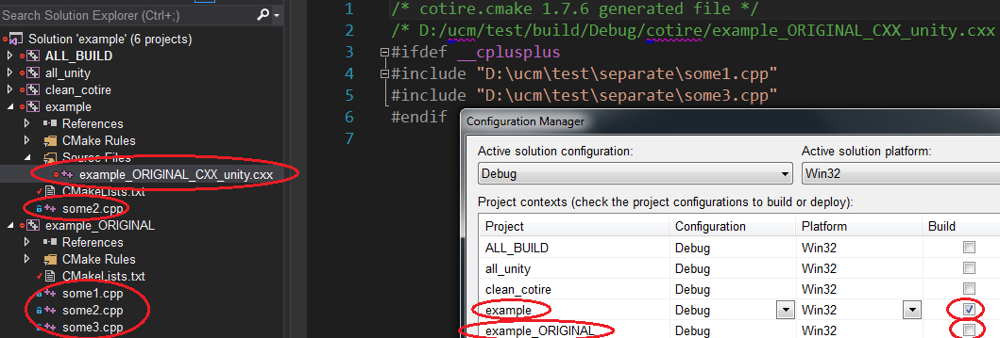

ucm - useful cmake macros
-------------------------

ucm is a collection of cmake macros that help with:

- managing compiler/linker flags
- collecting source files with grouping in IDEs that mimics the filesystem structure
- easy removing source files from already collected ones
- adding a precompiled header for targets
- [unity builds](#unity-builds) of targets
- others... contribution is welcome!

Tested with MSVC/GCC/Clang.

[cotire](https://github.com/sakra/cotire) is an optional submodule for the [ucm_add_target()](#ucm_add_target) macro either do ```git submodule update --init``` after cloning or include cotire in your cmake files before ucm.

[](https://en.wikipedia.org/wiki/CMake)
[](http://opensource.org/licenses/MIT)

Build status
------------

| Service               | Status |
|-----------------------|--------|
| Travis-CI (Linux/OSX) | [](https://travis-ci.org/onqtam/ucm)|
| Appveyor (Windows)    | [](https://ci.appveyor.com/project/onqtam/ucm)|

Documentation
-------------

##### <a name="macros"></a>Macros:

- [ucm_print_flags](#ucm_print_flags)
- [ucm_add_flags](#ucm_add_flags)
- [ucm_set_flags](#ucm_set_flags)
- [ucm_add_linker_flags](#ucm_add_linker_flags)
- [ucm_set_linker_flags](#ucm_set_linker_flags)
- [ucm_set_runtime](#ucm_set_runtime)
- [ucm_add_files](#ucm_add_files)
- [ucm_add_dirs](#ucm_add_dirs)
- [ucm_count_sources](#ucm_count_sources)
- [ucm_include_file_in_sources](#ucm_include_file_in_sources)
- [ucm_dir_list](#ucm_dir_list)
- [ucm_remove_files](#ucm_remove_files)
- [ucm_remove_directories](#ucm_remove_directories)
- [ucm_add_target](#ucm_add_target)

Macro notation: ```myMacro(NAME <name> [FLAG])``` - ```NAME``` and a name after it are required and FLAG is optional (because in brackets).

##### <a name="ucm_print_flags"></a>macro ```ucm_print_flags()```

Prints all relevant flags - for example with ```-DCMAKE_BUILD_TYPE=Debug``` given to cmake for makefiles:

```
CMAKE_C_FLAGS_DEBUG: -g
CMAKE_CXX_FLAGS_DEBUG: -g
CMAKE_C_FLAGS:  --save-temps -std=c++98 -pedantic -m64 -O2 -fvisibility=hidden
CMAKE_CXX_FLAGS:  --save-temps -std=c++98 -pedantic -m64 -O2 -fvisibility=hidden
```

or for a multi config generator like Visual Studio:

```
CMAKE_C_FLAGS_DEBUG: /D_DEBUG /MDd /Zi /Ob0 /Od /RTC1
CMAKE_CXX_FLAGS_DEBUG: /D_DEBUG /MDd /Zi /Ob0 /Od /RTC1
CMAKE_C_FLAGS_RELEASE: /MD /O2 /Ob2 /D NDEBUG
CMAKE_CXX_FLAGS_RELEASE: /MD /O2 /Ob2 /D NDEBUG
CMAKE_C_FLAGS:  /DWIN32 /D_WINDOWS /W3 /W4
CMAKE_CXX_FLAGS:  /DWIN32 /D_WINDOWS /W3 /GR /EHsc /W4
```

##### <a name="ucm_add_flags"></a>macro ```ucm_add_flags([C] [CXX] [CONFIG <config>] flag1 flag2 flag3...)```

Append the flags to a different set depending on it's options - examples:

```cmake
ucm_add_flags(-O3 -Wextra) # will add to CMAKE_C_FLAGS and CMAKE_CXX_FLAGS
ucm_add_flags(C -O3) # will add to CMAKE_C_FLAGS
ucm_add_flags(CXX -O3) # will add to CMAKE_CXX_FLAGS
ucm_add_flags(-O3 -Wall CONFIG Debug) # will add to CMAKE_C_FLAGS_DEBUG and CMAKE_CXX_FLAGS_DEBUG
```

##### <a name="ucm_set_flags"></a>macro ```ucm_set_flags([C] [CXX] [CONFIG <config>] flag1 flag2 flag3...)```

Removes the old and sets the new flags to a different set depending on it's options - examples:

```cmake
ucm_set_flags(CXX) # will clear CMAKE_CXX_FLAGS
ucm_set_flags() # will clear both CMAKE_C_FLAGS and CMAKE_CXX_FLAGS
ucm_set_flags(CXX -O3) # will set CMAKE_CXX_FLAGS
ucm_set_flags(-O3 -Wall CONFIG Debug) # will set CMAKE_C_FLAGS_DEBUG and CMAKE_CXX_FLAGS_DEBUG
```

##### <a name="ucm_add_linker_flags"></a>macro ```ucm_add_linker_flags([EXE] [MODULE] [SHARED] [STATIC] [CONFIG <config>] flag1 flag2 flag3...)```

Append the flags to a different set depending on it's options - examples:

```cmake
ucm_add_linker_flags(/NXCOMPAT) # will add to CMAKE_<TYPE>_LINKER_FLAGS (TYPE is all 4 - exe/module/shared/static)
ucm_add_linker_flags(EXE /DYNAMICBASE CONFIG Release) # will add to CMAKE_EXE_LINKER_FLAGS_RELEASE only
```

##### <a name="ucm_set_linker_flags"></a>macro ```ucm_set_linker_flags([EXE] [MODULE] [SHARED] [STATIC] [CONFIG <config>] flag1 flag2 flag3...)```

Removes the old and sets the new flags to a different set depending on it's options - examples:

```cmake
ucm_set_linker_flags(/NXCOMPAT) # will clear all CMAKE_<TYPE>_LINKER_FLAGS
ucm_set_linker_flags(EXE /DYNAMICBASE CONFIG Release) # will set CMAKE_EXE_LINKER_FLAGS_RELEASE only
```

##### <a name="ucm_set_runtime"></a>macro ```ucm_set_runtime([STATIC] [DYNAMIC])```

Sets the runtime to static/dynamic - for example with Visual Studio as a generator:

```cmake
ucm_print_flags()
ucm_set_runtime(STATIC)
ucm_print_flags()
```

will result in:

```
CMAKE_C_FLAGS_DEBUG: /D_DEBUG /MDd /Zi /Ob0 /Od /RTC1
CMAKE_CXX_FLAGS_DEBUG: /D_DEBUG /MDd /Zi /Ob0 /Od /RTC1
CMAKE_C_FLAGS_RELEASE: /MD /O2 /Ob2 /D NDEBUG
CMAKE_CXX_FLAGS_RELEASE: /MD /O2 /Ob2 /D NDEBUG
CMAKE_C_FLAGS:  /DWIN32 /D_WINDOWS /W3 /W4
CMAKE_CXX_FLAGS:  /DWIN32 /D_WINDOWS /W3 /GR /EHsc /W4

CMAKE_C_FLAGS_DEBUG: /D_DEBUG /MTd /Zi /Ob0 /Od /RTC1
CMAKE_CXX_FLAGS_DEBUG: /D_DEBUG /MTd /Zi /Ob0 /Od /RTC1
CMAKE_C_FLAGS_RELEASE: /MT /O2 /Ob2 /D NDEBUG
CMAKE_CXX_FLAGS_RELEASE: /MT /O2 /Ob2 /D NDEBUG
CMAKE_C_FLAGS:  /DWIN32 /D_WINDOWS /W3 /W4
CMAKE_CXX_FLAGS:  /DWIN32 /D_WINDOWS /W3 /GR /EHsc /W4
```

##### <a name="ucm_add_files"></a>macro ```ucm_add_files(src1 src2 scr3... TO <sources> [FILTER_POP <num>])```

Adds the sources to the sources variable and sets up filters for the solution explorer of Visual Studio (probably for XCode/CodeBlocks too).

The filters will mimic the filesystem - if we have given ```dir1/test/a.cpp``` we would have by default ```dir1/test``` as nested filters in the solution explorer. This can be controlled with ```FILTER_POP``` - 1 would result in only ```test``` as a filter and 2 would result in no filter for ```a.cpp``` - see [ucm_add_dirs](#ucm_add_dirs) for a visual example.

```CMake
ucm_add_files("dir/some1.cpp" "dir/some1.h" TO sources)
```

##### <a name="ucm_add_dirs"></a>macro ```ucm_add_dirs(dir1 dir2 dir3... TO <sources> [RECURSIVE] [FILTER_POP <num>])```

Adds all sources (sources and headers with all valid c/c++ extensions) from the directories given.

Can be recursive with the ```RECURSIVE``` flag.

Like ```ucm_add_files()``` filters for the solution explorer of IDEs can be controlled with ```FILTER_POP``` - example:

| CMake code                                       | result                           |
|--------------------------------------------------|----------------------------------|
| ```ucm_add_dirs(util TO sources)```              |  |
| ```ucm_add_dirs(util TO sources FILTER_POP 1)``` |  |

##### <a name="ucm_count_sources"></a>macro ```ucm_count_sources(src1 src2 src3... RESULT <result>)```

Given a list of sources - returns the number of source files (no headers - only valid source extensions) in the result.

```
set(sources "a.cpp;b.cpp;h.hpp")
ucm_count_sources(${sources} c.cpp d.cpp RESULT res) # would return 4 in res
```

##### <a name="ucm_include_file_in_sources"></a>macro ```ucm_include_file_in_sources(src1 src2 src3... HEADER <header>)```

Includes the header in the source file with a compile flag (without modifying the file) either with ```-include "hdr.h"``` or with ```/FI"hdr.h"``` depending on the compiler.

```CMake
ucm_include_file_in_sources(c.cc a.cc b.cc HEADER "common.h")
```

##### <a name="ucm_dir_list"></a>macro ```ucm_dir_list(<thedir> <result>)```

Returns a list of subdirectories for a given directory.

```CMake
ucm_dir_list("the/dir" result)
```

##### <a name="ucm_remove_files"></a>macro ```ucm_remove_files(src1 src2 src3... FROM <sources>)```

Removes the given source files from the sources list - example:

```CMake
ucm_add_dirs(utils REC TO sources)
ucm_remove_files(utils/deprecated.h FROM sources)
```

##### <a name="ucm_remove_directories"></a>macro ```ucm_remove_directories(dir1 dir2 dir3... FROM <sources> [MATCHES pttrn1 pttrn2])```

Removes all source files from the given directories from the sources list (recursively) - example:

```CMake
ucm_add_dirs(utils REC TO sources)
# and then remove only the ones we don't want
ucm_remove_directories(utils/deprecated utils/experimental FROM sources)
```

Patterns can also be given like this:

```CMake
ucm_remove_directories(utils FROM sources MATCHES win32)
```

##### <a name="ucm_add_target"></a>macro ```ucm_add_target(NAME <name> TYPE <EXECUTABLE|STATIC|SHARED|MODULE> SOURCES src1 src2 src3... [PCH_FILE <pch>] [UNITY [CPP_PER_UNITY <num>] [UNITY_EXCLUDED excl_src1 excl_src2 ...]])```

A wrapper of ```add_library()``` and ```add_executable()``` calls. Uses [cotire](https://github.com/sakra/cotire) for platform/compiler independent usage of precompiled headers and/or making a unity build of the target.

For information about unity builds in general go to the [bottom](#unity-builds).

```CMake
ucm_add_target(NAME example TYPE EXECUTABLE SOURCES "${sources}" PCH_FILE precompiled.h)
```

The example above shows how to add a target with a precompiled header.

```CMake
ucm_add_target(NAME example TYPE EXECUTABLE SOURCES "${sources}" UNITY CPP_PER_UNITY 20 UNITY_EXCLUDED "separate/some2.cpp")
```

When the ```UCM_UNITY_BUILD``` ucm option is set to ```ON``` (```OFF``` by default) a target registered like in the example above will actually result in 2 targets added - the unity target with ```example``` as a name (included in the build by default) and the original target with ```example_ORIGINAL``` as a name (excluded from the build by default). This allows the user to browse and modify the sources in the original target properly within the IDE. Also ```separate/some2.cpp``` will be built normally and will not be included in the unity sources.

When new sources are added to the original target the unity target will be updated accordingly by cotire.

The order in which sources are given to ```SOURCES``` is the order in which they will appear in the unity files so you can combat compilation issues by changing the order of the source files.

Targets can be excluded from unity builds by adding them in the ```UCM_UNITY_BUILD_EXCLUDE_TARGETS``` list when invoking cmake (handy if a target becomes problematic in a unity build or if you want to iterate fast on a particular target and want to compile it's sources separately).

Mixed language targets (C/C++) are handled properly - separate unity files are generated for the different languages.

The macro will self-diagnose the target and if it has more than 1 source file and has not been registered with the UNITY flag a developer warning will be printed that the target may benefit from a unity build.

CPP_PER_UNITY - to explicitly say how many source files should go into a unity source (default is 100). Another option is to pass not a number but ```-jX``` after ```CPP_PER_UNITY``` and that would mean dividing the sources into X unity sources.

UNITY_EXCLUDED - list of files from the target that should be excluded from unify-ing (will be used normally by themselves - can be used to fix compilation errors).

Unity examples - given 100 .cpp files in the target:

- ```CPP_PER_UNITY 5``` would mean 20 .cxx unity files including 5 of the original .cpp files each
- ```CPP_PER_UNITY 10``` would mean 10 .cxx unity files including 10 of the original .cpp files each
- ```CPP_PER_UNITY -j8``` would mean 8 .cxx unity files dividing the original 100 among them

How a unity target looks in the IDE:



Unity builds
------------

A unity build of a project is when all it's sources are included in a master unity source file which is then compiled. The point is to have faster compilation for full builds - up to 90% faster (less compiler invocations and less compiling of the same code from headers) and more optimizations (between the included sources which become one translation unit). For example:

```C++
// unity file
#include "test.cpp"
#include "ab.cpp"
#include "bla.cpp"
```

A unity build doesn't have to be in one unity source - for example a 100 .cpp target might be built in 10 unity files each including 10 of the original source files. Some sources can be built normally - separate from the unity file[s] if they are problematic. Build errors can be also combated by changing the order of the source files.

#### Pros

- The build is substantially faster - depending on the modularity of the code (less 10kloc source files) the gains can be huge - up to 90% faster!
- Unity builds are equivalent to LTO (link-time optimization or WPO/LTCG which make the build ultra slow) but faster even than the normal build!
- ODR (One Definition Rule) violations get caught - see [this](http://stackoverflow.com/questions/31722473)
- Unity builds force us to think about code hygiene - include guards in headers, no statics defined in headers, no non-inline function definitions in headers and most importantly LESS COPY/PASTE!!!

#### Cons

- The cmake configuration takes longer - a lot more cmake macros are executed - but this is negligible.
- Something that builds fine as a normal build might not as a unity - for example static variables (or just in anonymous namespaces) with the same names in 2 different source files, type redefinitions or some macro shenanigans. using namespace now becomes problematic even in normal source files.
- Preprocessor - it is outside of the type system and something may compile but might mean something different in a unity build - for example a macro with the same name (and number of arguments) as an identifier or macro redefinition.
- Non-explicit single argument constructors (or with N arguments and N-1 defaults) - there might be compilation errors or worse - the wrong overload might be chosen (miscompilation):

```C++
// a.cpp
struct MyStruct {
    MyStruct(int arg) : data(arg) {}
    int data;
};
int func(MyStruct arg) { return arg.data; }
int main() { return func(42); }
```

```C++
// b.cpp
int func(int arg) { return arg * 2; }
```

In the above example if a.cpp ends up after b.cpp in the same unity file the result of main() will be 84 instead of 42. But this has a very small chance of happening.
